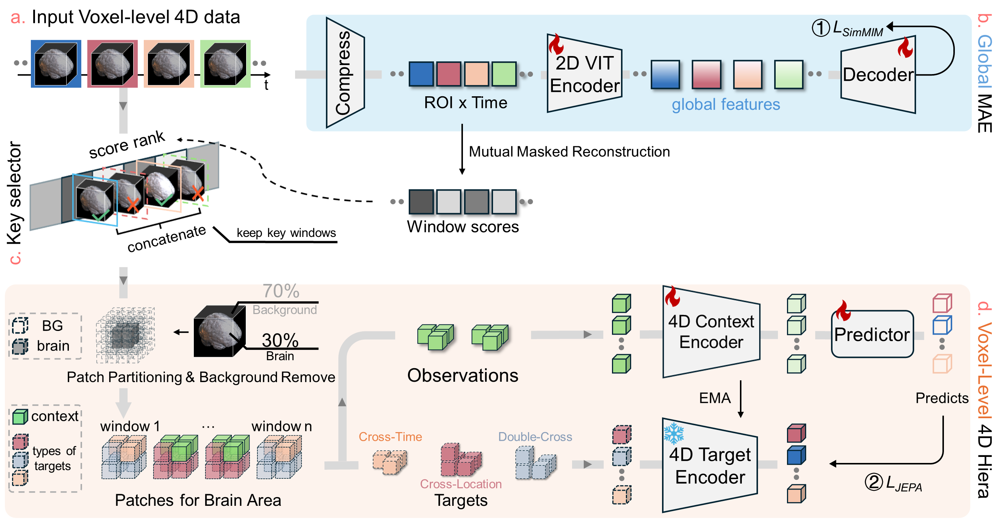

# SLIM-BRAIN: A DATA- AND TRAINING-EFFICIENT FOUNDATION MODEL FOR FMRI DATA ANALYSIS

<div align="center">
  
[](https://www.arxiv.org/abs/2512.21881)
[](https://github.com/OneMore1/SLIM-Brain2026)
[](https://huggingface.co/OneMore1/Slim-Brain)

</div>

This repository contains the official implementation of SLIM-Brain. SLIM-Brain is a two-stage, selective-compute pipeline for voxel-level fMRI representation learning. A lightweight global branch ranks informative temporal windows; a high-capacity 4D Hiera–JEPA encoder processes only those windows, focusing compute on brain voxels and drastically reducing memory.


<p align="center">
  
</p>

---

## Installation

Setting up the environment requires Python 3.13 and CUDA-compatible PyTorch for GPU acceleration:

```bash
conda create -n hiera-jepa python=3.13.5
conda activate hiera-jepa

# Install dependencies
pip install -r requirements.txt
```

## Project Structure

The codebase is organized into modular components for easy navigation and extension:

```
hiera-jepa/
├── configs/                    # YAML configuration files for training and model parameters
├── checkpoints/                # Saved model weights and training checkpoints
├── hiera/                      # Hierarchical Vision Transformer backbone implementation
├── scripts/                   # Bash....
├── finetune.py               # Downstream task training and feature extraction script
└── requirements.txt            # Python package dependencies
```

## Downstream evaluation

1. Ensure your pre-train data structure as follow:

```
data_root/
├── ABIDE_train/                
├── ABIDE_val/                  
├── HCP_val/              
└── HCP_train/              
    ├── 0010001/                # Subject ID
    └── 0010002/                
        ├── 0010002_run-1_0000-0199_1.npz  # Data chunk 1 
        ├── 0010002_run-1_0000-0199_2.npz  # Data chunk 2
```

2. Loading downstream datasets as following data structure:

```yaml
task:
  csv: "/path/to/data_csv"

data:
  data_root: /path/to/data_root
  datasets: ["HCP"]
  mode: "directory"
```

3. Start downstream training:

```bash
# running downstream training
sh scripts/finetune.sh
```

#### Model Checkpoints

Our pre-trained model weights can be found in https://huggingface.co/OneMore1/Slim-Brain


